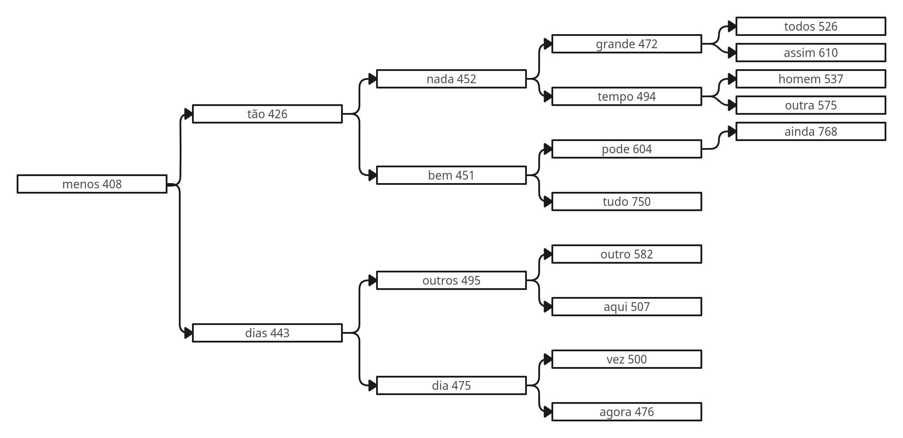
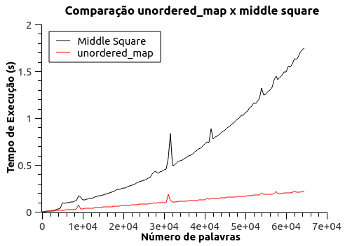

# Trabalho de Aquecimento

## Introdução

No problema conhecido como "Top K Itens", o objetivo é desenvolver um algoritmo capaz de listar as K palavras mais valiosas em um texto, selecionando as mais ou menos frequentes. Sendo esse K, um valor especificado pelo usuário. Utilizando estruturas de hash e heap, é possível criar uma solução com complexidade computacional de $O(n \cdot \log k)$, onde $n$ é o número total de palavras e $k$ é a quantidade de palavras escolhidas.

Este trabalho tem como objetivo principal desenvolver um algoritmo que seja capaz de listar os K termos mais frequentes em uma coleção de arquivos de texto. Além disso, serão implementadas estruturas de hash e heap. Por fim, será realizada uma comparação entre a função de hashing "Meio dos Quadrados" e a utilizada na implementação da estrutura unordered_map.

**Palavras-chave:** heap, min-heap, hash, unordered_map, meio dos quadrados.

### Observações

- O programa considerará todos os arquivos dentro da pasta "dataset" como entrada, independentemente do nome. Com exceção do arquivo "stopwords.data", que contém termos a serem ignorados na listagem. Este arquivo não deve ter seu nome alterado.
- O valor de K pode ser alterado dentro do arquivo `main.cpp`.

## Solução

Inicialmente, buscamos todos os termos dentro do arquivo de stopwords e os inserimos em uma estrutura de hash. Esses termos serão ignorados durante a contagem e não aparecerão na listagem final.

Após essa etapa, extraímos as palavras dos arquivos de entrada. Cada palavra que não seja uma _stopword_ é inserida na estrutura de hash. A palavra é usada como chave e sua frequência como valor, que é incrementado a cada ocorrência. Ao final desse processo, temos uma lista com todas as palavras e sua quantidade de aparições no texto.

As estruturas de hash são uma alternativa interessante nessa etapa devido à sua complexidade aproximadamente constante.

Em seguida, implementamos uma min-heap. Isso facilitará a remoção de valores, já que sempre removeremos o menor valor, a fim de manter os maiores valores dentro da estrutura.

As estruturas de heap, sejam min ou max, têm complexidade logarítmica no número de itens armazenados para inserção ou remoção (do topo) e um custo constante para recuperar o topo. No pior caso da nossa solução, onde sempre será necessário remover uma palavra e inserir outra, teremos complexidade $O(n \cdot \log k)$.

O pior caso seria testar as palavras em ordem crescente, da menos comum até a mais comum nos textos.

Os primeiros K elementos da tabela hash serão inseridos na heap. Em seguida, para o restante dos elementos, verificamos se seu valor é maior que o menor valor dentro da heap. Se isso acontecer, o item da heap é removido e o item da iteração é inserido.

É possível perceber que, caso um valor não seja maior que o topo da min-heap, ele consequentemente não será maior que nenhum outro elemento. Isso garante que nossa heap sempre terá os maiores elementos, e para isso, é necessário fazer comparações apenas com o menor elemento.

Para exibir os K termos iremos imprimir, sequencialmente, na tela o vetor que armazena os valores. É importante observar que é possível montar diferentes heaps para os mesmos valores e ambas serem válidas.

Portanto, a complexidade total da solução pode ser descrita como:

- $O(n)$ → para percorrer as palavras do texto
- $O(k \cdot \log k)$ → para inserir os $k$ primeiros itens
- $O((n-k) \cdot \log k)$ → para tentar inserir o restante dos elementos na heap
- $O(k)$ → para exibir os $k$ itens

Simplificando, a complexidade do algoritmo pode ser descrita como $O(n \cdot \log k)$.

## Implementação

### Lendo os arquivos

Durante o programa, são realizadas duas leituras: uma para buscar os textos de entrada e outra para as stopwords, ambas usando a biblioteca fstream do C++.

As stopwords estão em um arquivo formatado de maneira específica, com cada palavra em uma linha. Em nosso código, fazemos a leitura linha por linha e aplicamos a palavra a uma das estruturas de hash.

Já o texto de entrada, por ser um texto comum, é lido caractere por caractere, a fim de fazer as validações e categorizações necessárias. Se o caractere da iteração for válido, ou seja, pode aparecer em uma palavra, ele é concatenado à palavra. Os caracteres são lidos até encontrarmos um separador válido, que pode ser ' ' (espaço em branco), ',' (vírgula), '.' (ponto final), '!' (ponto de exclamação), '?' (ponto de interrogação) ou '\n' (fim de parágrafo).

Existem alguns caracteres especiais que são ignorados. Por exemplo, na palavra “faça-se”, o caractere “-” é ignorado, e a palavra é contabilizada como “façase”.

### unordered_map

A estrutura `unordered_map` faz parte da biblioteca padrão do C++ e é definida na biblioteca `<map>`. Essa estrutura é uma implementação de hash que não ordena os itens armazenados. Para utilizá-la, é necessário definir o tipo de dado da chave e do valor entre os sinais de maior e menor, seguindo a sintaxe `unordered_map<tipo_chave, tipo_valor>`.

Na nossa implementação, o tipo da chave é string e o tipo do valor é um inteiro, representando a palavra e sua frequência, respectivamente.

### Meio do Quadrado

Para a implementação desse algoritmo, criamos uma função chamada `hash`. Ela recebe como parâmetro uma string, que será a chave, e retorna o resultado do cálculo. Para obter o valor, realizamos os seguintes cálculos: os valores ASCII de cada caractere são somados, transformando a palavra em um valor numérico. Esse valor é elevado ao quadrado, e dele é retirada a parte central, caracterizada pelos N elementos centrais. O valor de N é o número de dígitos da soma dos caracteres.

**Exemplo:**

Inserindo a palavra "aquecimento":
- Soma = 1179
- Quadrado = 1390041
- Meio do quadrado = 900

Inserindo a palavra "algoritmo":
- Soma = 974
- Quadrado = 948676
- Meio do

 quadrado = 867

Como o quadrado tem um número par de dígitos, o meio fica deslocado para a direita.

#### Hash e Rehash

Para a implementação, montamos uma classe com as seguintes operações:

```cpp
class Hash {
   private:
    vector<pair<string, int>> array;
    size_t hash(string key);
    void rehash();

   public:
    Hash();
    virtual ~Hash();
    vector<string> keys;
    void insert(string key);
    void insert(string key, int value);
    bool find(string key);
    pair<string, int> at(string key);
};
```

Para remover o meio, precisamos saber o número de dígitos que devemos retirar da direita. Esse valor é dado pela subtração do número de dígitos no valor, após ser elevado ao quadrado, menos a quantidade que queremos. Um truque simples para se descobrir quantos dígitos tem um número é tirar o logaritmo na base 10 e somar mais 1.

```cpp
size_t Hash::hash(string key) {
    size_t keySum = sumDigits(key);
    size_t square = keySum * keySum;

    size_t squareDigits = floor(log10(square) + 1);
    size_t keyDigits = floor(log10(array.size()) + 1);

    size_t middle = getSquareMiddle(squareDigits, keyDigits, square);

    if (middle >= this->array.size()) return middle % this->array.size();

    return middle;
};
```

O método de rehash aumenta o tamanho do vetor e reposiciona todos os elementos que já estavam nele. Essa função é chamada sempre que atingimos um fator de carga de 75%. O fator de carga é um valor obtido pela divisão do tamanho do vetor pelo número de elementos inseridos, ou seja, representa a ocupação do vetor.

Os motivos para a estrutura de hash não ter complexidade constante estão relacionados principalmente às colisões. Como não existe uma função de hashing perfeita que associe cada chave a um único índice, as colisões precisam ser tratadas. Nessa implementação, ao ocorrer uma colisão, percorremos linearmente o vetor até encontrar uma posição válida. Isso pode gerar um custo $O(n)$ para buscas e inserções. Além disso, ao percorrer o vetor, caso encontremos uma palavra, é preciso compará-la com a palavra que estamos tentando inserir. Isso se torna um problema, pois a comparação de strings tem custo linear e nossa função de inserir terá uma tendência quadrática para grandes entradas de dados.

Para tentar diminuir esse gargalo, utilizamos a função de rehash. Ao aumentar o tamanho do vetor, diminuímos a chance de colisões. No entanto, para executar essa função, temos um custo linear no número de elementos já inseridos. Portanto, é necessário o uso do fator de carga para chamar a função de rehash apenas quando o vetor estiver muito denso.

### Heap

Para nossa solução, foi mais conveniente implementar a heap em vez de utilizar alguma estrutura pronta, a fim de compreender melhor o algoritmo e analisar os detalhes de implementação.

```cpp
class Heap {
   private:
    vector<pair<string, int>> array;
    void heapify_up(int index);
    void heapify_down(int index);

   public:
    int size();
    bool empty();
    void push(pair<string, int> item);
    pair<string, int> top();
    void pop();
};
```

O método `void heapify_up(int index)` é chamado durante a inserção na heap e coloca o item inserido na posição correta. Enquanto o valor for menor que seu pai, eles são trocados, fazendo com que o item "suba" na heap até a posição correta, ou seja, quando encontrar um item de valor menor ou chegar ao topo da heap.

```cpp
void Heap::heapify_up(int index) {
    int parent = (index - 1) / 2;

    if (parent < 0) return;

    int parentFreq = array[parent].second;
    int indexFreq = array[index].second;

    if (parent != index && parentFreq > indexFreq) {
        swap(array[parent], array[index]);
        heapify_up(parent);
    }
}
```

O método `void pop()` remove o item que está no topo da heap. O elemento que queremos remover está na posição 0 do vetor. Portanto, pegamos o último elemento do vetor e o colocamos na primeira posição, o que elimina o valor. Em seguida, removemos a última posição do vetor, visto que esse elemento foi transferido para a primeira posição. Sempre que um elemento é inserido, o método `heapify_down` é executado.

O método `void heapify_down(int index)` é chamado durante as remoções e coloca o valor trazido da última posição na heap no seu lugar correto. É verificado se algum dos filhos do elemento é menor que ele, e, caso seja, a troca é feita. Se ambos os filhos forem menores, escolhemos o menor entre eles.

```cpp
void Heap::heapify_down(int index) {
    int left = (2 * index) + 1;
    int right = (2 * index) + 2;

    int smaller = index;

    int childLeft = this->array[left].second;
    int childRight = this->array[right].second;

    int indexFreq = this->array[index].second;

    if (left < size() && childLeft < indexFreq) {
        smaller = left;
    }

    if (right < size() && childRight < childLeft) {
        smaller = right;
    }

    if (smaller != index) {
        swap(this->array[smaller], this->array[index]);
        heapify_down(smaller);
    }
}
```

## Resultados

### Saída

A saída do programa tem o seguinte formato: exibir duas listas com as K palavras mais frequentes, mostrando o vetor interno da heap, para as duas implementações.

Para os arquivos dentro da pasta dataset, com K = 20, temos a seguinte saída:

```
unordered_map

Elementos na Heap:
menos 408
tão 426
nada 452
dia 475
dias 443
agora 476
outro 582
vez 500
todos 526
bem 451
grande 472
aqui 507
pode 604
assim 610
outros 495
tudo 750
outra 575
ainda 768
homem 537
tempo 494

Time taken to execute in seconds : 0.332556

---------------

Meio dos quadrados

Elementos na Heap:
menos 408
bem 451
tão 426


nada 452
tempo 494
grande 472
dias 443
agora 476
aqui 507
outros 495
outra 575
vez 500
dia 475
tudo 750
outro 582
todos 526
assim 610
ainda 768
homem 537
pode 604

Time taken to execute in seconds : 0.550004
```

#### unordered_map


#### Meio dos quadrados



### Comparação unordered_map x meio dos quadrados

Para gerar os testes, criamos um gerador de textos aleatórios. Este gerador recebe como parâmetro o número de palavras e gera um arquivo com esse número. Foram gerados textos de 0 a 64.500 palavras. Cada um desses textos foi utilizado como entrada para ambas implementações, realizando 3 execuções em cada, para gerar a média do tempo de execução.



A partir dos testes, observamos três pontos importantes:

1. Para entradas de dados pequenas, até 10.000 palavras, os algoritmos tiveram um comportamento parecido, com poucos milissegundos de diferença e mostrando um comportamento linear. No entanto, para o "meio dos quadrados", esse comportamento não se reflete para amostras maiores.

2. Ao aumentar o volume de dados, conseguimos perceber que o `unordered_map` manteve o custo linear esperado. No entanto, a outra implementação mostrou um comportamento quadrático. Esse comportamento está relacionado ao tratamento de colisões utilizado.

3. Mesmo com um comportamento pior para entradas maiores, a implementação "meio dos quadrados" ainda mantém uma diferença de tempo relativamente pequena para o contexto que estamos utilizando. Portanto, é uma escolha possível para solucionar esse problema.

## Conclusão

Neste trabalho, conseguimos analisar a eficiência de estruturas de dados para a resolução de problemas, especialmente a extração das palavras mais frequentes em textos relativamente grandes. Nessa situação, ao optar por métodos quadráticos ou até mesmo algoritmos de ordenação, teríamos um tempo de execução muito pior, possivelmente impedindo o programa de concluir a tarefa em um tempo razoável.

Além disso, pudemos compreender melhor as estruturas de heap e hash. Para realizar o trabalho, foi necessário realizar várias pesquisas sobre o funcionamento desses algoritmos. A escolha de implementar essas estruturas em vez de usar soluções prontas contribuiu ainda mais para nosso entendimento.

Por fim, conseguimos comparar duas implementações de hash. Os resultados mostraram que mesmo um método de hash simples, como o "meio dos quadrados", pode ser utilizado para solucionar certo problemas, mas perde em performance quando comparado a outras implementações, por exemplo, a solução utilizada no `unordered_map` da biblioteca padrão.